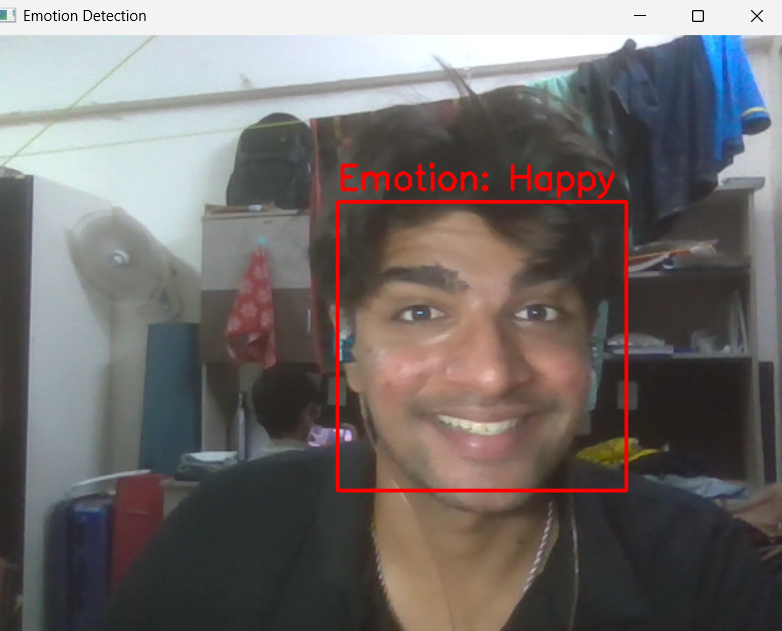
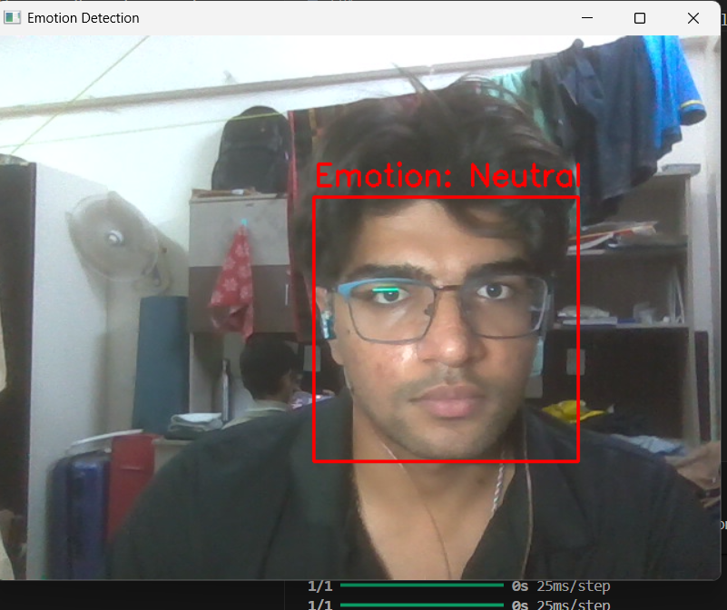
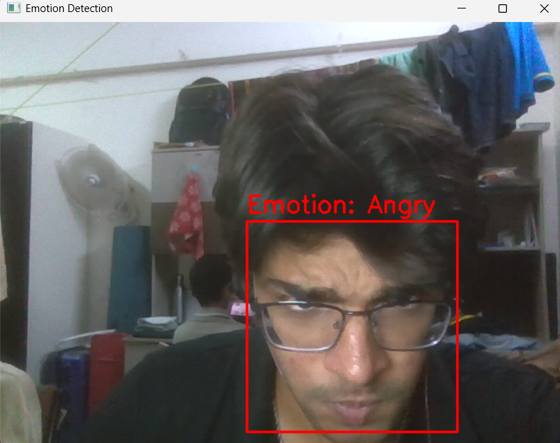
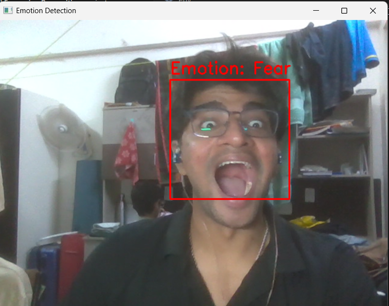
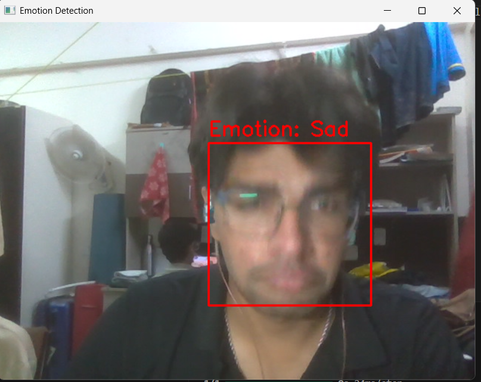

# Facial Expression Recognition

A real-time facial expression recognition system using deep learning. It detects faces via webcam and classifies emotions into 7 categories: **Happy, Sad, Angry, Surprise, Fear, Neutral, and Disgust**.

Built with TensorFlow/Keras and OpenCV.

---

## Results

| Happy | Neutral | Angry |
|:---:|:---:|:---:|
|  |  |  |

| Surprised | Fear | Sad |
|:---:|:---:|:---:|
|  |  |  |

---

## Project Structure

```
├── main/
│   ├── main.py              # Real-time webcam emotion detection
│   ├── predict.py           # Prediction module with confidence scores
│   ├── train.py             # Improved recognizer with visualization
│   ├── train_improved.py    # Model training with data augmentation
│   ├── data_loader.py       # Dataset loading utility
│   └── split_dataset.py     # Model diagnosis tool
├── Dataset/
│   └── pretrained/
│       └── face_model.h5    # Pre-trained emotion detection model
├── results/                 # Output screenshots
├── requirements.txt
└── README.md
```

---

## Setup

### 1. Clone the repository

```bash
git clone https://github.com/<your-username>/Facial-Expression-Recognition.git
cd Facial-Expression-Recognition
```

### 2. Create a virtual environment

```bash
python -m venv venv
```

**Activate it:**

- Windows: `venv\Scripts\activate`
- macOS/Linux: `source venv/bin/activate`

### 3. Install dependencies

```bash
pip install -r requirements.txt
```

---

## How to Run

### Real-time Emotion Detection (Webcam)

```bash
python main/main.py
```

Opens your webcam, detects faces, and displays the predicted emotion. Press **`q`** to quit.

### Prediction Module

```bash
python main/predict.py
```

Runs webcam detection with confidence scores for each emotion.

### Train the Model

```bash
python main/train_improved.py
```

Trains a new CNN model on your dataset with data augmentation, class balancing, and callbacks. Requires `Dataset_split/` directory with `train/` and `validation/` folders.

### Model Diagnosis

```bash
python main/split_dataset.py
```

Tests the model with different inputs to check if predictions are varied.

### Dataset Statistics

```bash
python main/data_loader.py
```

Prints class-wise image counts for train and test splits.

---

## Tech Stack

- **Python 3.x**
- **TensorFlow / Keras** — CNN model for emotion classification
- **OpenCV** — Face detection (Haar Cascade) and webcam capture
- **NumPy** — Array operations
- **scikit-learn** — Class weight computation

---

## Model Details

- **Input:** 48×48 grayscale face image
- **Architecture:** Multi-layer CNN with BatchNormalization, Dropout, and L2 regularization
- **Output:** 7 emotion classes — Angry, Disgust, Fear, Happy, Sad, Surprise, Neutral
- **Face Detection:** Haar Cascade Classifier (`haarcascade_frontalface_default.xml`)
